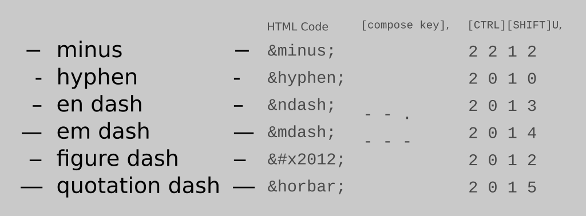

<!--

https://blog.errantruminant.com/dashes/
https://github.com/taw00/howto/blob/master/howto-dashes.md

Excerpt: How to Input the Dash-family of Punctuation—Minus, Hyphen, En Dash, Em Dash, and more—in the Linux GNOME Desktop Environment.
-->

Minuses, Hyphens and Dashes. Oh, my!
====================================

_Published November 1, 2019 <!--&mdash; Updated November 1, 2019-->_

The Problem
-----------

If you write anything that is more substantive than a short social-media post or informal correspondence, em dashes are used quite frequently. En dashes are less common, but used occasionally. The problem: There is no key on the keyboard for the em, en dash, or minus sign. This can be maddening.

The first part of this article maps out the various dash-like punctuation characters, and why and how they are used when writing. The second part is a technical how-to for those wanting to make inserting such characters a bit more trouble free, particularly in the Linux GNOME Desktop Environment.

The Cheat Sheet (TL;DR)
-----------------------

- Minus (&minus;): `[CTRL][SHIFT][U]`, then `2` `0` `1` `2` `[ENTER]`
- Hyphen (-): typed directly from keyboard  
- En dash (–): `[compose]`, then `-` `-` `-`
- Em dash (—): `[compose]`, then `-` `-` `.`

|         | html &code  | compose `[compose key]`, then ... | unicode `[SHIFT][CTRL]U`, then ... |
| ------- | --------------- | ------- | --------|
| minus   | `&minus;`       | n/a     | `2` `2` `1` `2` |
| hyphen (use `-` on the keyboard) | `&hyphen;` | n/a | `2` `0` `1` `0` |
| en dash | `&ndash;`       | `-` `-` `.`   | `2` `0` `1` `3` |
| em dash | `&mdash;`       | `-` `-` `-`   | `2` `0` `1` `4` |
|   |   |   |   |
| hyphen, non-breaking | `&#x2011;` | n/a | `2` `0` `1` `1` |
| figure dash | `&#x2012;`  | n/a     | `2` `0` `1` `2` |
| quotation dash (aka horizontal bar) | `&horbar;` | n/a     | `2` `0` `1` `5` |

About Minuses, Hyphens, and Dashes
----------------------------------

Minuses equal the width of other arithmetic symbols and are vertically aligned. Em Dashes are approximately the width of the letter "M", En Dashes the width of the letter "N", and Hyphens shorter still. Figure Dashes, and Quotation Dashes are more rare and unique, but have their own specifications.

**Minuses** are used in arithmetic expressions:  
&emsp;_5&minus;4&plus;1&equals;2_  
&emsp;. . . if a hyphen is used instead, the difference can be subtle, but noticable:  
&emsp;_5&hyphen;4&plus;1&equals;2_

**Hyphens** are used to hyphenate a compound word: _merry&hyphen;go&hyphen;round_.

**En dashes** are not used as often, but are intended to be used for expressions of range (time, numbers, etc.), most often as a replacement for the word "to", and indicate that the values are inclusive:  
  &emsp;_Years 1900&ndash;2000._  
  &emsp;_The New York&ndash;San Francisco route._  
  &emsp;_The score was 27&ndash;17._

**Em dashes** are used for two primary purposes: 1. They are used to indicate a stronger break in a sentence than commas or parentheses. 2. They are used similarly to colons, but with a smidge more drama.

Em dashes in place of commas or parenthesis:  
  &emsp;_The anniversary of the eruption of Mount St. Helens&mdash;May 18, 1980&mdash;brought_  
  &emsp;_back vivid memories of ash and darkness._

Em dash in place of a colon:  
  &emsp;_There was only one thing missing from the pirate ship—pirates._

Em dashes are also used in citations, to indicate interruptions, to indicate blotted out text, and more. But that won't be discussed here.

Read more about when to use hyphens, dashes, colons, parentheses, and more:
- [Dashes, Colons, and Commas](https://www.quickanddirtytips.com/education/grammar/dashes-colons-and-commas)
- [Dashes, Parentheses, and Commas](https://www.quickanddirtytips.com/education/grammar/dashes-parentheses-and-commas)
- [Hyphens](https://www.quickanddirtytips.com/education/grammar/hyphens)
- [En Dash](https://www.thepunctuationguide.com/en-dash.html)
- [Em Dash](https://www.thepunctuationguide.com/em-dash.html)
- [Em Dash(—) vs. En Dash(–)](https://7esl.com/em-dash-en-dash/)

**Figure Dashes** are used in things like phone numbers: _1&#x2012;800&#x2012;867&#x2012;5309_

**Quotation Dashes** are used for things like dialogue in certain styles of writing (Charles Frazier, James Joyce), though often em dashes are used instead:  
  &emsp;_&horbar;Oh, my! Dashes can be complicated, said the young journalist._  
  &emsp;. . . another example:  
  &emsp;_&horbar;I'm thinking on it, Inman said. How did you get in this fix?_

For more information about figure and quotation dashes (out of scope), read these: [Figure Dash](https://en.wikipedia.org/wiki/Dash#Figure_dash), [Quotation Dash](https://en.wikipedia.org/wiki/Quotation_mark#Quotation_dash).

###### A Visual Comparison

  &emsp;minus **hyphen** en dash **em dash** figure dash **quotation dash**  
  &emsp;&minus; **&hyphen;** &ndash; **&mdash;** &#x2012; **&horbar;**  
  &emsp;&minus;minus&minus;  
  &emsp;&hyphen;hyphen&hyphen;  
  &emsp;&ndash;en dash&ndash;  
  &emsp;&mdash;em dash&mdash;  
  &emsp;&#x2012;figure dash&#x2012;  
  &emsp;&horbar;quotation dash&horbar;

> ----
>
> Note: For the remainder of this document, we are going to focus primarily on hyphens, en dashes, and em dashes. The discussion will also get a bit more technical in places. But if you are a writer in any capacity—especially if you are using Linux—you should know some of these techniques.
>
> ---

The Hyphen
----------

Inputting the hyphen on your keyboard is easy. The _hyphen key_ is just to right of the _0 key_ (zero-key) on most keyboards.

For most cases, the hyphen can be used in place of a minus sign, or even a figure dash. If you are displaying some light arithmetic equations though, you probably want to use the more precise character (the minus). Phone numbers generally use figure dashes. And if you want to ensure a word is not word-wrapped (like in a heading) the non-breaking hyphen is useful.

It should be noted that many people will just use hyphens in the place of en and em dashes as well (one hyphen for an en dash and two for an em dash), and many editors will overlook this, but if you are writing more formally, consider using the correct symbol instead. We no longer live in the days of typewriters.

Dashes in Word Processors
-------------------------

Inputting an em dash in a word processor _can be_ relatively easy. Most will replace any `[-][-][space]` with `—`. If a particular word processor does not enable this feature by default, look for the setting in the preferences menu somewhere and enable it if you like. I personally like to input these characters more directly from the keyboard. More on that in a second. For other characters, there is usually a "Insert special character" selection in one of the menus.

HTML- and Markdown-Formatted Documents
--------------------------------------

If you are creating an HTML- or Markdown-formatted document, a common method for inserting a special character is through the use of HTML ASCII or Unicode escape codes in the text. A few of these even have human-readable entity names: `&minus;`, `&ndash;`, and `&mdash;`. And even `&horbar;`.

For example, this document was originally written in the Markdown format. It is very common to input these characters as HTML `&` escape codes, but I generally prefer to input the hyphen and em dashes directly from the keyboard. One great advantage of the escape codes, though, is that they eliminate ambiguity (the minus, hyphen, and en dash can look very similar).

More about Markdown can be found [here](https://en.wikipedia.org/wiki/Markdown), [here](https://commonmark.org/help/), and [here](https://www.markdownguide.org/extended-syntax). And more about HTML ASCII escape codes can be found [here](https://ascii.cl/htmlcodes.htm). You can use HTML escape codes in Markdown documents, not just HTML-formatted files.

Markdown is widely used in many MANY applications now. Most note-taking applications support it, some by default, or even nearly exclusively (example [Joplin](https://joplinapp.org), my personal favorite). But also forum software ([Discourse](https://www.discourse.org/)), blogging and website interfaces ([Ghost][919ee899] and [Wordpress][a7500213]), and many other applications.

  [919ee899]: https://ghost.org "Ghost Blogging Platform"
  [a7500213]: https://wordpress.org "Wordpress Web Publishing Platform"

The GNOME Desktop Environment
-----------------------------

All of the various operating systems and their respective desktop environments give you a couple ways to enable special character input that allows uniform behavior no matter what application you are using. For the purposes of this how-to, I am going to describe how to do it in GNOME, the default desktop environment for many favors of Linux, to include Fedora, RHEL, and Ubuntu.

> For other environments (Apple, Microsoft, or Linux running KDE or very old GNOME) take a look at the article referenced at the end of this article.

### Compose Key Method

For these, a _Compose Key_ is used. In Fedora's GNOME environment it is not enabled by default. Or, at least, it was not in my desktop settings. To enable it, you need to install the "GNOME Tweak Tool", a package that gives you more power over configuration of the desktop.

**Install GNOME Tweak Tool**

Install from the desktop UI:
- Open the "Software" application
- Search for "GNOME Tweaks"
- Install

Install from the command line:
- Fedora and EL8, RHEL8/CentOS8): `sudo dnf install gnome-tweaks -y`
- Ubuntu (I _believe_ this is correct): `sudo apt install gnome-tweak-tool`

**Enable and Map the Compose Key**

1. Open "Tweaks"
2. Select "Keyboard & Mouse"
3. Look for "Compose Key" and click on "Disabled"
4. Flip the switch from "OFF" to "ON"
5. Choose what you use for your compose key. I use "Caps Lock"  
   _Note: whatever you choose, this setting will
   override any other use for that key._

**Use the Compose Key**

Now open up a text editor (`gedit` will work, but any will do) and give it a test drive. Heck, this will even work in any social-media message field if you'd like to try it there.

For an en dash (`[compose]`, then `-` `-` `.`), or
- `[compose key]`
- `[hyphen key]`
- `[hyphen key]`
- `[period key]`

  _You should now see an en dash character (&ndash;)._

For an em dash (`[compose]`, then `-` `-` `-`), or
- `[compose key]` (in my case, the `[CAPS]` key)
- `[hyphen key]` (i.e., the hyphen key on the keyboard)
- `[hyphen key]`
- `[hyphen key]`

  _You should now see an em dash character (&mdash;)._

### Unicode Input Method

You can use the Unicode input method instead of using the compose key. It's a bigger PITA and hard to remember, but useful to know so you can input other Unicode characters when necessary:

- `[CTRL][SHIFT][U]`

  _An underlined "u" should appear._

- The Unicode for the character needed
- `[ENTER]`  
  _Note: the `[ENTER]` at the end may or may not be necessary, depending on the environment and application._

For example:
- Minus sign: (&minus;): `[CTRL][SHIFT][U]`, then `2` `2` `1` `2` `[ENTER]`
- Hyphen (&hyphen;): use the keyboard's native `-` key.  
- En dash (&ndash;): `[CTRL][SHIFT][U]`, then `2` `0` `1` `3` `[ENTER]`
- Em dash (&mdash;): `[CTRL][SHIFT][U]`, then `2` `0` `1` `4` `[ENTER]`
- Figure dash (&#x2012;): `[CTRL][SHIFT][U]`, then `2` `0` `1` `2` `[ENTER]`
- Quotation dash (&horbar;): `[CTRL][SHIFT][U]`, then `2` `0` `1` `5` `[ENTER]`

A great summary of some of the most used `[CTRL][SHIFT][U]` Unicode input codes can be found in the "Diacritics and punctuation" section of this article: [Linux keyboard text symbols: Compose key shortcuts](https://fsymbols.com/keyboard/linux/compose/).

An exhaustively comprehensive Unicode reference can be found [here](https://unicode-table.com/).

Other Environments
------------------

Are you a Microsoft or Apple user? That's beyond the scope of this document, but here's a good starting point: [5 Ways to Type a Dash](https://www.wikihow.com/Type-a-Dash).

Happy Writing!
--------------

That's it! Good luck and enjoy your writing. Writing that aims to be more exacting in its selection of dash-like punctuation.
